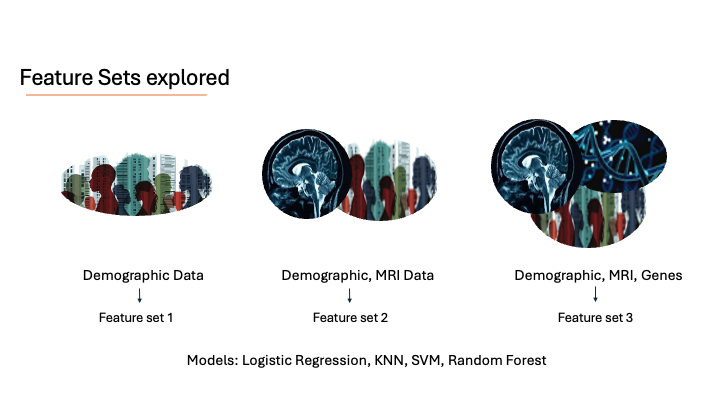
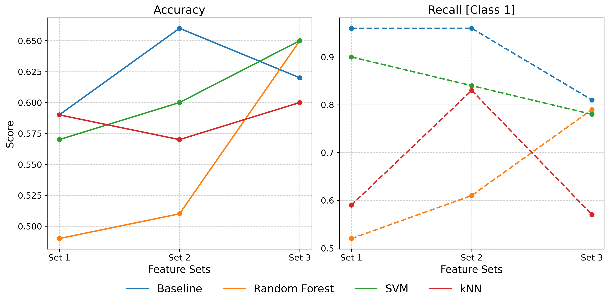

# Parkinson's disease severity prediction
This library is designed for the Erdos Institute's data science bootcamp project.

📌 Project Note

All code, analysis, and documentation in this version represent independent work by Pushpita Das.
Earlier iterations of this project were collaboratively developed as part of the bootcamp (<a href="https://github.com/veenabala123/summer-2025-parkinsonpredict"> Github).


## 🧠 Project Overview

Parkinson’s disease (PD) is the second most common neurodegenerative disease, affecting over 1 million people in the United States and over 8.5 million people globally. PD rates are increasing and the diagnosis rate has doubled over the last 25 years (WHO). With no cure in sight, PD remains a complex disease with difficult to predict disease progression. Certain biomarkers, such as combinations of 𝜶-synucleins and inflammation-related biomarkers tumor necrosis factor (TNF)-𝜶 and interleukins (IL) accumulate in PD patients but complex interactions between biomarkers make using them to predict disease progression a challenge (Eidson et al. 2017; Li and Le 2020). Our project aims to utilize data science principles and machine learning to create models that predict PD from demographic, MRI, and biomarker data.

This repository contains code for a project that aims to predict the progression of Parkinson's disease using machine learning techniques. The project uses data from the Parkinson’s Progression Markers Initiative (PPMI) open‑access repository. A patient’s baseline genetic profile + MRI biomarkers and demographics, is used to predict the  MDS‑UPDRS Part III (ΔUPDRS III) score (a clinically meaningful measure of motor deterioration).

👥 Stakeholders:
- 🧓 People with Parkinson’s Disease and their caretakers.
- 💊 Pharma and biotech teams running Parkinson’s trials.
- 🧪 Fellow Researchers working in this field.
- 🧠 Neurologists.

📊 KPIs:
- 🎯 Recall : Ensures model correctly identifies patients with PD.
- 📌 Feature Importance : Which features are more effective.
  
## 📦 Prerequisites
- Access to the Parkinson's Progression Markers Initiative (PPMI) dataset. The data sets used in this repo are not available publicly.
- Python 3.10+
- NumPy
- Seaborn
- Pandas
- Matplotlib
- scikit-learn

## 🛠️ Project Structure

```
summer-2025-parkinsonpredict
├── initial_feature_selection/
    ├──feature_engineering.py #select best features for different models
    ├──gene_patientmatrix.py  #making gene matrix from 50000 genes               
├── src/
│   ├── config.py           
│   ├── model.py            
│   ├── data_loader.py   
│   └── evaluation.py            
├── notebooks/
│   ├── Feature_Selection     
    ├── data_exploration      
    ├── models                #notebooks for different models, training and testing
├── README.md
```
## Results

<p float="left">
  
  
</p>

## ⚙️ Usage
To access the data, you should request the data from PPMI directly.
To use this project, clone the repository and run the Jupyter notebooks provided. The notebooks contain the code for data preprocessing, model training, and evaluation. Make sure to have the following required libraries installed.

## 🤝 Contributions
Thank you for considering contributing to this project. We welcome contributions from everyone. Please contact authors for questions and comments.


